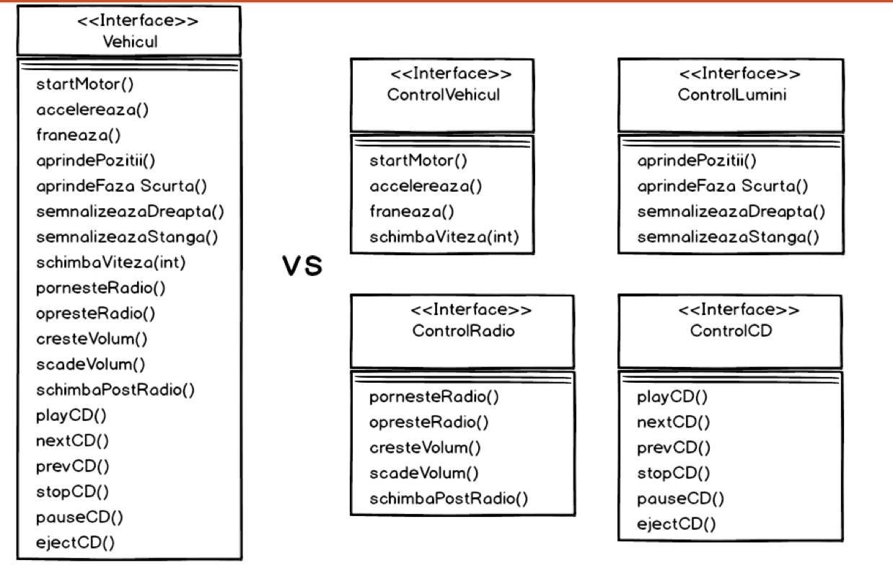

# Clean Code

> “Any fool can write code that a computer can understand. Good programmers write code that humans can understand. ” by Martin Fowler

## Ce inseamna Clean Code

- Codul trebuie sa fie usor de citit

- Codul trebuie sa fie usor de inteles

- Codul trebuie sa fie usor de modificat de catre oricine

### Glass Breaking Code

- Un cod care are dependinte in multe module externe

### Tight Coupled

- Strans legat de alte secvente de cod

## Principiile Clean Code

### DRY

- Do not Repeat Yourself

- Aplicabil cand dam Copy + Paste unei bucati de cod

- Aplicabil cand ne dam seama ca avem 2 metode care fac acelasi lucru

### KISS

- Keep It Simple and Stupid

- Ori de cate ori vrem ca o metoda sa faca de toate

- Beneficii:
  - Rezolvarea rapida de probleme
  - Rezolvarea unor probleme complexe intr-o maniera simpla
  - Realizarea de produse complexe usor de intretinut
  - Codul este mai flexibil
  - Codul este mai usor de extins si modificat daca apar noi cerinte

### YAGNI

- You Ain't Gonna Need It

- Nu scriem metode ce nu sunt necesare

### SOLID

1. Single responsability (SRP)

- O clasa trebuie sa aiba intotdeanuna o singura responsabilitate si numai una

- In caz contrar, orice schimbare de specificatii va duce la inutilitatea ei si rescrierea intregului cod

```java
class Student {
    void platesteTaxa() {
        // ...
    }

    void sustineExamanePOO() {
        // ...
    }

    void salvareBazaDate() {
        // ...
    }
}
```

- Avem o clasa despre un student

- Depinde de modificari din 3 zone diferite: contabilitate, academic (examen) si departament IT

```txt
| ----------------- |
|      Employee     |
| ----------------- |
|    calculatePay   |  < -------- Director Financiar
|    reportHours    |  < -------- Director General
|       save        |  < -------- Director Tehnic
| ----------------- |
```

- Clasa angajat poate fi modificata de oricare dintre cei 3 actori de mai sus

- Solutia este impartirea clasei in trei clase astfel incat fiecare sa raspunda unui actor

```txt
| ----------------- |
|   PayCalculator   |
| ----------------- |   -------------|
|    calculatePay   |                |
| ----------------- |                |
                                     |
                                     |
| ----------------- |                |
|   HoursReporter   |                |
| ----------------- | -------------- | -------> Employee Data
|    reportHours    |                |
| ----------------- |                |
                                     |
                                     |
| ----------------- |                |
|   EmployeeSaver   |                |
| ----------------- | -------------- |
|       save        |
| ----------------- |
```

- Pentru a incorpora totul am nevoie de un Employee Facade cu _calculatePay_, _reportHours_ si _save_

2. Open-closed (OCP)

- Clasele trebuie sa fie deschide pentru extensii si inchide pentru modificari

3. Liskov substitution (LSP)

- Orice instanță a unei clase de bază trebuie să poată fi înlocuită cu o instanță a unei clase derivate, fără a modifica comportamentul corect al programului.

> Dacă o funcție funcționează cu obiecte de tip Base, trebuie să continue să funcționeze corect și cu obiecte de tip Derived.

- Cunoscut ca "Desgin by Contract"

  - Clasa de bază definește un contract: reguli, comportamente, restricții.
  - Clasele derivate trebuie să respecte acel contract.
  - Dacă o clasă derivată încalcă contractul, atunci înlocuirea devine periculoasă și încalcă principiul LSP.

- Exemplu care respecta Liskov substitution

```java
class Animal {
    public void speak() {
        System.out.println("Animal speaks");
    }
}

class Dog extends Animal {
    @Override
    public void speak() {
        System.out.println("Dog barks");
    }
}
```

- Exemplu care NU respecta Liskov Substitution

```java
class Rectangle {
    protected int width, height;

    public void setWidth(int w) { width = w; }
    public void setHeight(int h) { height = h; }

    public int getArea() { return width * height; }
}

class Square extends Rectangle {
    @Override
    public void setWidth(int w) {
        width = w;
        height = w;
    }

    @Override
    public void setHeight(int h) {
        height = h;
        width = h;
    }
}
```

- Un Square nu poate fi tratat ca un Rectangle fără efecte secundare ⇒ încalcă LSP.

- Pe scurt, se respecta daca nu suprascriem o metoda din clasa parinte in clasa copil

4. Interface segregations (ISP)

- Mai multe interfete specializabile sunt oricand de preferat fata de una singura, generala

- Obiectele nu trebuie sa implementeze metode inutile



5. Dependency inversion

> Program to interfaces, not implementations

> Depend on abstractions, not on concrete classes

- Modulele de nivel înalt (cele care coordonează logica de business) nu trebuie să depindă direct de modulele de nivel jos (cele care implementează detalii tehnice).

- Ambele trebuie să depindă de abstracții (interfețe sau clase abstracte).

- Implementările concrete trebuie să depindă de abstracții, nu invers.

- Exemplu bun

```java
public interface IMessageService {
    void sendMessage(String message);
}

public class EmailService implements IMessageService {
    public void sendMessage(String message) {
        System.out.println("Email: " + message);
    }
}

public class NotificationManager {
    private IMessageService service;

    public NotificationManager(IMessageService service) {
        this.service = service;
    }

    public void notify(String message) {
        service.sendMessage(message);
    }
}
```

- Exemplu care NU respecta Dependency Inversion

```java
public class NotificationManager {
    private EmailService emailService;

    public NotificationManager() {
        this.emailService = new EmailService();
    }

    public void notify(String message) {
        emailService.sendMessage(message);
    }
}
```

- NotificationManager depinde direct de o clasă concretă (EmailService) și este greu de reutilizat/testat.

## Complexitatea Ciclomatica (CC)

> Complexitatea Ciclomatica = Numarul de muchii - Numarul de noduri + 2

- Metodele simple au complexitatea 1 (fara if - else, switch)

```java
int a;  // nod 1
// prima muchie
a = 5; // nod 2
// a doua muchie
a++ // nod 3
```

- CC = 2 - 3 + 2 = 1

```java
if (x<5) {  // nod 1
    // prima muchie
    y++;    // nod  2
} else {
    // a doua muchie
    y--;    // nod 3
}
// a treia + a patra muchie (vine o muchie de pe if si una de pe else)
System.out.println(y); // nod 4
```

- CC = 4 - 4 + 2 = 2

- CC spune numarul minim de teste unitare care trebuie efectuate pentru verificarea unei functii

---

[Back](../README.md)
