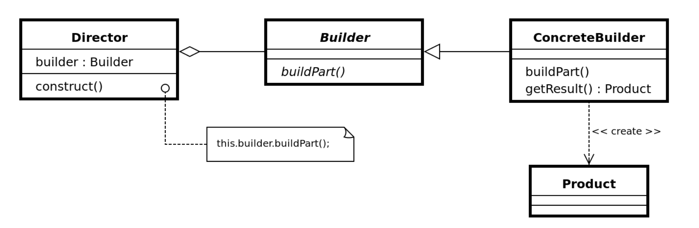

# Builder

- Ajuta la crearea de obiecte concrete

- Se construiesc obiecte complexe prin specificarea anumitor proprietăți dorite din multitudinea existentă.

- Obiectele create sunt finale



## Problema

- Agenția AgeTur oferă pachete de transport cu facilități extra precum: WiFi, animale de companie, locuri pentru fumători, aer condiționat, televizor.

- Aceste facilități sunt adăugate doar dacă un client le dorește, nefiind incluse în pachetul de bază.

---

- Clasa concreta

```java
package v1_builder;

public class PachetTransport {
 private boolean hasWiFi;
 private boolean hasAnimale;
 private boolean isFumator;
 private boolean hasAC;
 private boolean hasTV; 
 
 public PachetTransport(boolean hasWiFi, boolean hasAnimale, boolean isFumator, boolean hasAC, boolean hasTV) {
  super();
  this.hasWiFi = hasWiFi;
  this.hasAnimale = hasAnimale;
  this.isFumator = isFumator;
  this.hasAC = hasAC;
  this.hasTV = hasTV;
 }
 
 public boolean isHasWiFi() {
  return hasWiFi;
 }
 public void setHasWiFi(boolean hasWiFi) {
  this.hasWiFi = hasWiFi;
 }
 public boolean isHasAnimale() {
  return hasAnimale;
 }
 public void setHasAnimale(boolean hasAnimale) {
  this.hasAnimale = hasAnimale;
 }
 public boolean isFumator() {
  return isFumator;
 }
 public void setFumator(boolean isFumator) {
  this.isFumator = isFumator;
 }
 public boolean isHasAC() {
  return hasAC;
 }
 public void setHasAC(boolean hasAC) {
  this.hasAC = hasAC;
 }
 public boolean isHasTV() {
  return hasTV;
 }

 public void setHasTV(boolean hasTV) {
  this.hasTV = hasTV;
 } 

 @Override
 public String toString() {
  return "PachetTransport [hasWiFi=" + hasWiFi + ", hasAnimale=" + hasAnimale + ", isFumator=" + isFumator
    + ", hasAC=" + hasAC + ", hasTV=" + hasTV + "]";
 }
}
```

---

- Interfata Builder

```java
package v1_builder;

public interface Builder {
 PachetTransport build();
}
```

- Clasa Builder

```java
package v1_builder;

public class PachetTransportBuilder implements Builder {

 private PachetTransport pachetTransport;
 
 public PachetTransportBuilder() {
  pachetTransport=new PachetTransport(false, false, false, false, false);
 }
 
 @Override
 public PachetTransport build() {
  return pachetTransport;
 }
 
 public PachetTransportBuilder setHasWiFi(boolean hasWiFi) {
  this.pachetTransport.setHasWiFi(hasWiFi);
  return this;
 }
 
 public PachetTransportBuilder setHasAnimale(boolean hasAnimale) {
  this.pachetTransport.setHasAnimale(hasAnimale);
  return this;
 }

 public PachetTransportBuilder setFumator(boolean isFumator) {
  this.pachetTransport.setFumator(isFumator);
  return this;
 } 

 public PachetTransportBuilder setHasAC(boolean hasAC) {
  this.pachetTransport.setHasAC(hasAC);
  return this;
 }
 
 public PachetTransportBuilder setHasTV(boolean hasTV) {
  this.pachetTransport.setHasTV(hasTV);
  return this;
 }
}
```

---

- Builder V2

```java
package v2_builder;

public class PachetTransportBuilder implements Builder {
 private boolean hasWiFi;
 private boolean hasAnimale;
 private boolean isFumator;
 private boolean hasAC;
 private boolean hasTV;
 
 public PachetTransportBuilder() {
  this.hasWiFi=false;
  this.hasAnimale=false;
  this.isFumator=false;
  this.hasAC=false;
  this.hasTV=false;
 }
 
 @Override
 public PachetTransport build() {
  return new PachetTransport(hasWiFi, hasAnimale, isFumator, hasAC, hasTV);
 }

 public PachetTransportBuilder setHasWiFi(boolean hasWiFi) {
  this.hasWiFi = hasWiFi;
  return this;
 }

 public PachetTransportBuilder setHasAnimale(boolean hasAnimale) {
  this.hasAnimale = hasAnimale;
  return this;
 }

 public PachetTransportBuilder setFumator(boolean isFumator) {
  this.isFumator = isFumator;
  return this;
 }

 public PachetTransportBuilder setHasAC(boolean hasAC) {
  this.hasAC = hasAC;
  return this;
 }

 public PachetTransportBuilder setHasTV(boolean hasTV) {
  this.hasTV = hasTV;
  return this;
 } 
}
```

### Variante de implementare

- Există trei variante de implementare ale acestui Design Pattern:

1. Crearea obiectului complex în constructorul clasei Builder și modificarea atributelor conform cerințelor. În această situație Builder (PachetTransportBuilder) are un singur atribut de tipul Produs (PachetTransport).
    - Dacă PachetTransport se schimbă (ex: se adaugă o nouă opțiune), clasa builder trebuie modificată, și în constructorul intern.

2. Crearea obiectului complex se realizează în metoda build() pe baza setărilor realizate. În această situație clasa Builder (PachetTransportBuilder) conține aceleași atribute ca și clasa Produs (PachetTransport).
    - Varianta aceata respecta Open-Close principle pentru ca poate sa fie extinsa cu usurinta

3. Implementare care presupune utilizarea unei clase imbricate (Inner class).

## Utilizari

- In general, pentru construirea de obiecte complexe

- StringBuilder / DocumentBuilder (Android)

---

[Back](0_IntroducereainDesignPatterns(1).md)
