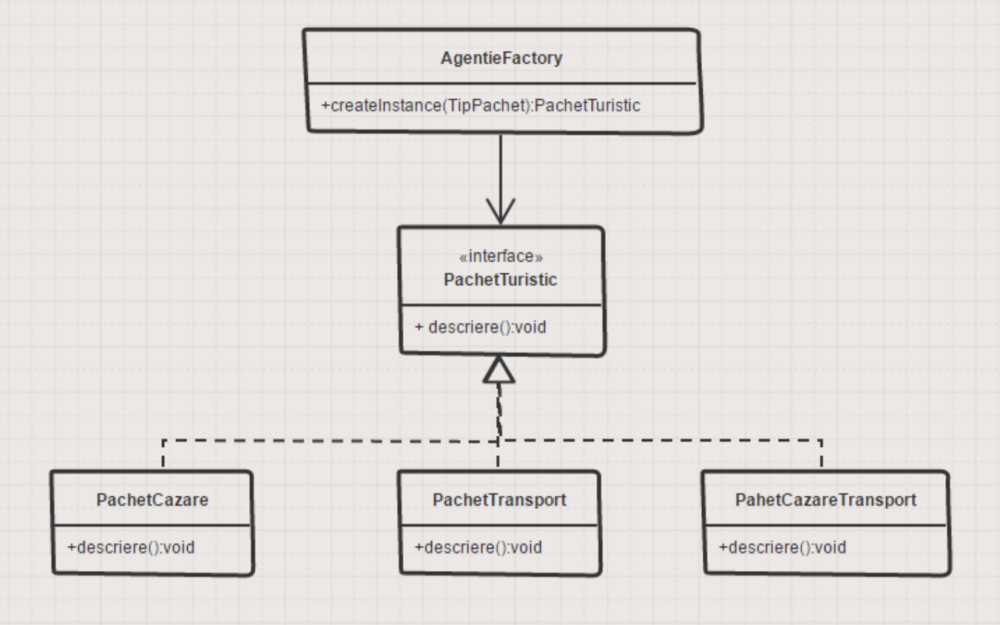

# Factory

- Permite crearea obiectelor concrete dintr-o familie de obiecte, fara sa stie exact tipul concret

- **SINTAGMA:** familie de obiecte, obiecte din aceeasi familie


## Problema

- Agenția de turism AgeTur oferă pahete turistice cu cazare și transport însă are în ofertă și pachete turistice doar cu cazare sau doar cu transport. Toate ofertele fac parte din familia pachetelor turistice.



### Participanti

- Interfața PachetTuristic – poate fi și clasă abstractă.

- Clasele concrete PachetCazare, PachetTransport, PachetCazareTransport implementează interfața PachetTuristic.

- Fabrica AgentieFactory – este clasa care va crea obiectele concrete prin intermediul metodei createInstance().

### Implementare

- *createInstance()* din AgentieFactory primeste tipul de pachet (dintr-un enum) si returneaza tipul concret de obiect

- Interfata din Simple Factory

```java
package agentie.clase;

public interface PachetTuristic {
 void descriere();
}
```

- Tipurile de pachete

```java
package agentie.clase;

public class PachetCazare implements PachetTuristic {

 @Override
 public void descriere() {
  System.out.println("Acest pachet include doar cazare");
 }

}

package agentie.clase;

public class PachetTransport implements PachetTuristic {

 @Override
 public void descriere() {
  System.out.println("Acest pachet inlude doar transport");
 }
}

package agentie.clase;

public class PachetCazareTransport implements PachetTuristic {

 @Override
 public void descriere() {
  System.out.println("Acest pachet inlude cazare si transport");
 }
}
```

- Fabrica de obiecte

```java
package agentie.clase;

public class AgentieFactory {
 
 public PachetTuristic createPachet(TipPachet tipPachet) throws Exception {
  switch (tipPachet) {
  case pachetCazare:
   return new PachetCazare();
  case pachetTransport:
   return new PachetTransport();
  case pachetCazareSiTransport:
   return new PachetCazareTransport();
  default:
   throw new Exception("Tipul primit nu este corect");
  }
 }
}
```

- Fabrica poate sa fie si Singleton

```java
package agentie.clase;

public class AgentieSingletonFactory {
 private static AgentieSingletonFactory instanta = null;
 
 private AgentieSingletonFactory(){
  
 }
 
 public static synchronized AgentieSingletonFactory getInstanta(){
  if(instanta == null) {
   instanta=new AgentieSingletonFactory();
  }
  return instanta;
 }
 
 public PachetTuristic createPachet(TipPachet tipPachet) throws Exception {
  switch (tipPachet) {
   case pachetCazare:
    return new PachetCazare();
   case pachetTransport:
    return new PachetTransport();
   case pachetCazareSiTransport:
    return new PachetCazareTransport();
   default:
    throw new Exception("Tipul primit nu este corect");
  }
 }
}
```

- Apelarea in Main

```java
package agentie.program;

import agentie.clase.AgentieFactory;
import agentie.clase.PachetTuristic;
import agentie.clase.TipPachet;

public class Program {

 public static void main(String[] args) {
  AgentieFactory agentieFactory = new AgentieFactory();
  PachetTuristic pachetTuristic = null;
  try {
   pachetTuristic = agentieFactory.createPachet(TipPachet.pachetCazare);
  } catch (Exception e) {
   e.printStackTrace();
  }
  
  pachetTuristic.descriere();

  /*AgentieSingletonFactory agentieFabrica = AgentieSingletonFactory.getInstanta();
  try {
   pachetTuristic = agentieFabrica.createPachet(TipPachet.pachetCazareSiTransport);
  } catch (Exception e) {
   e.printStackTrace();
  }
  pachetTuristic.descriere();*/
 }

}
```

## Utilizari

- Crearea de view-uri in GUI

- Existenta unei familii de obiecte intr-o aplicatie

---

[Back](0_IntroducereainDesignPatterns(1).md)
