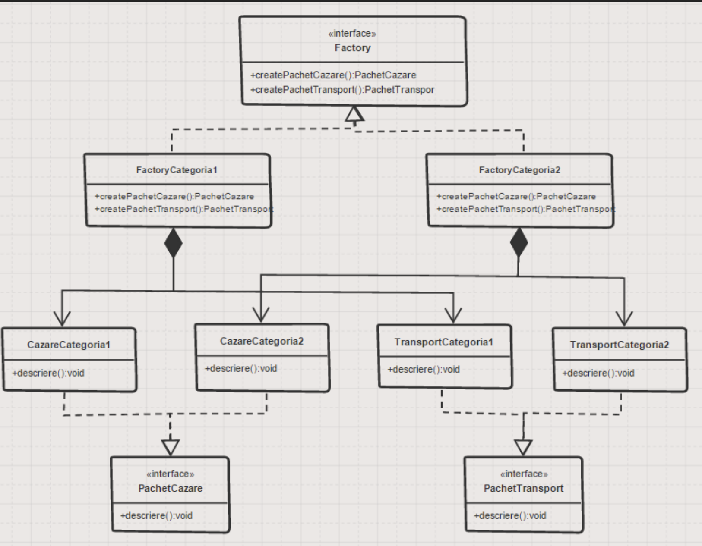

# Abstract Factory

- Abstract Factory introduce un nou nivel de abstractizare

- Fiecare fabrica de obiecte creează obiecte din doua sau mai multe familii de obiecte

## Problema

- Agenția de turism AgeTur oferă pachete de cazare și pachete de transport. Pentru cazare agenția are în ofertă un pachet ieftin la hotel de 3 stele și un pachet scump la hotel de 5 stele. Pentru transport, agenția are în ofertă pachet ieftin cu autocarul și pachet scump cu avionul.



### Implementare

- Consideram ca avem 4 clase: CazareCategoria1, CazareCategoria2, TransportCategoria1, TransportCategoria2

- Avem interfetele PachetCazare, PachetTransport cu comportamentul comun pentru fiecare tip de pachet

---

- Avem o fabrica pentru categoria 1

```java
package agentie.clase;

public class FactoryCategoria1 implements Factory {

 @Override
 public PachetCazare createPachetCazare() {
  return new CazareCategoria1();
 }

 @Override
 public PachetTransport createPachetTransport() {
  return new TransportCategoria1();
 }

}
```

---

```java
package agentie.clase;

public class FactoryCategoria2 implements Factory {

 @Override
 public PachetCazare createPachetCazare() {
  return new CazareCategoria2();
 }

 @Override
 public PachetTransport createPachetTransport() {
  return new TransportCategoria2();
 }

}
```

---

- Main

```java
package agentie.program;

import agentie.clase.Factory;
import agentie.clase.FactoryCategoria1;
import agentie.clase.PachetCazare;

public class Program { 
 PachetCazare obtineCazare(Factory fabrica){
  return fabrica.createPachetCazare();
 }

 public static void main(String[] args) {
  Factory fabricaAgentie=new FactoryCategoria1();
  PachetCazare cazare= fabricaAgentie.createPachetCazare();
  cazare.descriere();
 }
}
```

- Abstract factory – interfața Factory;

- ConcreteFactory – Clasele FactoryCategoria1 și FactoryCategoria2;

- AbstractProduct – Interfețele PachetCazare și PachetTransport;

- ConcreteProduct – Clasele concrete pentru Cazare și Transport pe cele două categorii.

- Fiecare fabrica creeaza unul sau mai multe tipuri de obiecte

#### Explicatii

- Creeaza combinatii de tipuri de cazare si transport in functie de cum cere implementarea

- Fiecare fabrica imi creeaza o combinatie de cazare si de transport

---

[Back](0_IntroducereainDesignPatterns(1).md)
