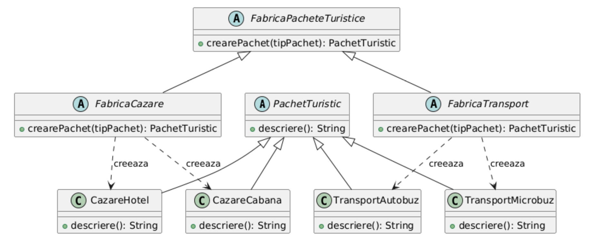

# Factory Method

- Este asemanator cu Simple Factory, dar abstractizeaza nivelul de creare

- Se mai numeste si **Virtual Constructor**


## Problema

- Aceeasi problema ca la simple factory

- Interfata specifica pachetelor turistice

```java
package factory_method.clase;

public interface PachetTuristic {
    void afisareDescriere();
}
```

- Consideram urmatoarele clase: CazareCabana, CazareHotel, TransportAutobuz, TransportMicrobuz

---

- Interfata de tip factory

```java
package factory_method.fabrici;

import factory_method.clase.PachetTuristic;

public interface PachetTuristicFactory {
    PachetTuristic crearePachet(TipPachetTuristic tip);
}
```

- Fabrica de transporturi

```java
package factory_method.fabrici;

import factory_method.clase.PachetTuristic;
import factory_method.clase.TransportAutobuz;
import factory_method.clase.TransportMicrobuz;

public class TransportFactory implements PachetTuristicFactory{
    @Override
    public PachetTuristic crearePachet(TipPachetTuristic tip) {
        return switch (tip){
            case TipPachetTransport.TransportAutobuz -> new TransportAutobuz();
            case TipPachetTransport.TransportMicrobuz -> new TransportMicrobuz();
            default -> null;
        };
    }
}
```

- Fabrica de cazuri

```java
package factory_method.fabrici;

import factory_method.clase.CazareCabana;
import factory_method.clase.CazareHotel;
import factory_method.clase.PachetTuristic;

public class CazareFactory implements PachetTuristicFactory{
    @Override
    public PachetTuristic crearePachet(TipPachetTuristic tip) {
        return switch (tip){
            case TipPachetCazare.CazareCabana -> new CazareCabana();
            case TipPachetCazare.CazareHotel -> new CazareHotel();
            default -> null;
        };
    }
}
```

---

- Main

```java
package factory_method.program;

import factory_method.clase.PachetTuristic;
import factory_method.fabrici.*;

public class Program {
    public static void main(String[] args) {
        PachetTuristicFactory fabrica=new CazareFactory();
        PachetTuristicFactory fabricaTransport=new TransportFactory();

        PachetTuristic pachet=fabrica.crearePachet(TipPachetCazare.CazareCabana);
        pachet.afisareDescriere();
        pachet=fabricaTransport.crearePachet(TipPachetTransport.TransportMicrobuz);
        pachet.afisareDescriere();
    }
}
```

---

- Ideea principala este ca am fabrici suplimentare pentru fiecare tip de pachet. Putem avea si PachetTuristicCazare, PachetTuristicCazareTransport, PachetTuristicTransport si fiecare tip de pachet vine cu fabrica proprie.

- Fabrica principala apeleaza fabrica custom a fiecarui tip de pachet.

- Este similar cu o fabrica care are mai multe linii de productie



---

[Back](0_IntroducereainDesignPatterns(1).md)
