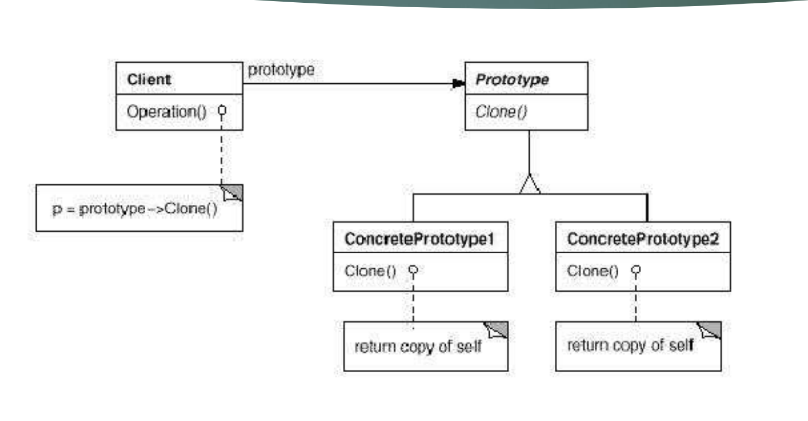

# Prototype

- Ajuta la crearea de clone pentru obiecte care necesita multe resurse pentru creare

- Prin intermediul acestui design pattern se creează un obiect considerat prototip. Acest prototip urmând a fi clonat pentru următoarele instanțe din acea clasă.



## Problema

- Agenția AgeTur dorește să trimită lista de oferte existentă în baza de date, tuturor clienților.

- Trimiterea ofertelor tuturor clienților durează foarte mult deoarece la fiecare client este creat un obiect de tipul ListaOferte. La crearea obiectului se citesc din fișier toate ofertele.

- Să se găsească o soluție eficientă prin care listele de oferte să fie încărcate mai repede.

### Implementare

- Prototype inseamna, de regula, implementarea Clonable

- ATENTIE: clone() din clonable face, by default, shallow copy

---

- Intefata

```java
package oferte.deep;

public interface IListaOferte {
 IListaOferte copiaza();
 void incarcaListaOferte();
}
```

---

- Clasa ListaOferte

```java
package oferte.deep;

import java.io.BufferedReader;
import java.io.FileNotFoundException;
import java.io.FileReader;
import java.io.IOException;
import java.util.ArrayList;
import java.util.List;

public class ListaOferte implements IListaOferte {

 private List<String> oferte;
 
 public void setOferte(List<String> oferte) {
  this.oferte = oferte;
 }

 public ListaOferte() {
  oferte=new ArrayList<String>();
 }

 @Override
 public void incarcaListaOferte() {
  try {
   BufferedReader reader=new BufferedReader(new FileReader("oferte"));
   String oferta=null;
   while((oferta=reader.readLine())!=null) {
    oferte.add(oferta);
   }
  } catch (FileNotFoundException e) {
   // TODO Auto-generated catch block
   e.printStackTrace();
  } catch (IOException e) {
   // TODO Auto-generated catch block
   e.printStackTrace();
  }
 }
 
 @Override
 public IListaOferte copiaza() {
  ListaOferte listaOferte=new ListaOferte();
  List<String> listaTemporara=new ArrayList<String>();
  for(String oferta:this.oferte){
   listaTemporara.add(oferta);
  }
  listaOferte.setOferte(listaTemporara);
   
  return listaOferte;
 }

 @Override
 public String toString() {
  return "ListaOferte [oferte=" + oferte + "]";
 }

}
```

---

- Main

```java
package oferte.program;

import oferte.deep.*;

public class Program {
 
 public static void main(String[]args) {
  IListaOferte listaOferte=new ListaOferte();
  listaOferte.incarcaListaOferte();
  
  IListaOferte copieListaOferte = null;
  copieListaOferte = listaOferte.copiaza();  
  
  System.out.println(copieListaOferte.toString());
  
 }

}
```

### Utilizari

- Atunci când obiectele create seamănă între ele, iar crearea unui obiect durează foarte mult sau consumă resurse foarte multe.

- Aplicabil ori de câte ori folosim clone()

---

[Back](0_IntroducereainDesignPatterns(1).md)
